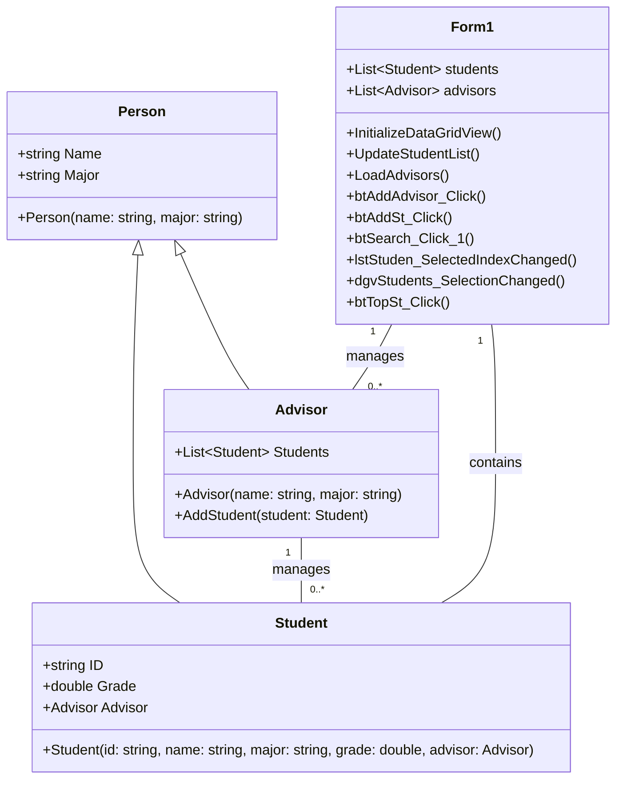

## StudentManagement 
by Panuwat Prasertdee 673450474-0 IS KKU61

## Ui

## 📌 Class Diagram

## ฟีเจอร์หลักและฟังก์ชันการทำงาน:

1.การจัดการนักศึกษาและที่ปรึกษา:
เพิ่มที่ปรึกษา: เพิ่มที่ปรึกษาใหม่ลงในรายการ และอัปเดต ComboBox ของที่ปรึกษา รวมถึงเคลียร์ฟิลด์ข้อมูลหลังจากเพิ่มสำเร็จ
เพิ่มนักศึกษา: เพิ่มนักศึกษาใหม่ลงในรายการพร้อมกับการตรวจสอบข้อมูล (เช่น การตรวจสอบความซ้ำของรหัสนักศึกษา, การป้อนเกรดที่ถูกต้อง, การเลือกที่ปรึกษา) นักศึกษาจะถูกมอบหมายให้กับที่ปรึกษา และ UI จะได้รับการอัปเดต
แสดงรายชื่อนักศึกษา: แสดงรายชื่อนักศึกษาผ่าน DataGridView และ ListBox เมื่อคลิกที่นักศึกษาใน ListBox หรือ DataGridView จะมีข้อมูลของนักศึกษาปรากฏใน Label
ฟังก์ชันการค้นหา:

2.ปุ่มค้นหาช่วยให้ผู้ใช้สามารถกรองนักศึกษาตามรหัสนักศึกษาหรือชื่อ โดยจะมีการอัปเดต DataGridView และแสดงผลใน MessageBox (พบข้อมูลหรือไม่พบข้อมูล)
การแสดงนักศึกษาที่เก่งที่สุด:

3.ปุ่มจะแสดงนักศึกษาที่มีเกรดสูงสุด โดยแสดงชื่อและเกรดของนักศึกษาคนนั้น

## มีไฟล์ Document ให้อ่านด้วยนะครับ
https://github.com/panuwat05/StudentManagement/blob/main/Document.txt
